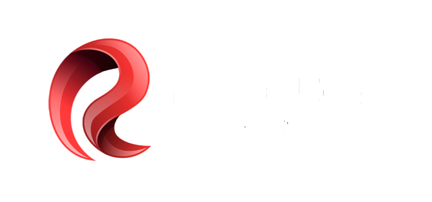

# 🎆 Revolution Events - Transform Your Vision Into Reality



**Developed by:** KELVIN BONIPHACE  
**Phone:** +255 699 846 887 / +255 760 838 487  
**Location:** Dar es Salaam, Tanzania  
**Year Built:** 2026  

---

## Welcome to Revolution Events

This is a modern, elegant, and fully responsive website for **Revolution Events Ltd** - Tanzania's premier event production specialists. We create unforgettable moments through world-class fireworks, cutting-edge LED technology, stunning projection mapping, and much more.

With over 20 years of experience, we pride ourselves on delivering excellence to corporate clients, government agencies, celebrities, and leading brands across Tanzania. Whether your event is intimate or massive, we bring professionalism, creativity, and magic.

---

## 🌟 What We Offer

Our five core specialisms bring your vision to life:

### 🎆 **Fireworks & Pyrotechnics**
Spectacular aerial displays and safe ground pyrotechnics. Perfect for weddings, corporate celebrations, independence days, and special occasions. All ISO-certified for safety.

### 📺 **High-Definition LED Screens**
Professional-grade LED walls with stunning visual impact. Ideal for conferences, product launches, festivals, and live events. We have the largest inventory of P2 LED panels in Tanzania.

### 🎥 **Projection Mapping**
Transform any surface into a dynamic visual canvas. Using cutting-edge 3D projection technology, we create immersive experiences that mesmerize audiences.

### ✨ **Visual Effects**
Fog machines, confetti cannons, CO₂ thrusters, laser shows, and flame throwers. These special effects add excitement and emotion to your event.

### ⛺ **Marquee & Tent Hire**
Elegant outdoor structures for any weather. We provide coverage up to 50m × 20m, perfect for outdoor weddings, festivals, and corporate events.

---

## 📱 Website Features

Our website showcases everything Revolution Events stands for:

- **Hero Section** - Eye-catching landing page with company statistics and call-to-action
- **About Us** - Our story, credentials, and core values
- **Our Specialisms** - Detailed showcase of our five core services with stunning images
- **Our Process** - Simple four-step workflow: Consultation → Design → Production → Delivery
- **Portfolio** - Filterable gallery of past events with real project images
- **Trusted Clients** - Over 30+ brands and organizations we've worked with
- **Testimonials** - Real feedback from satisfied clients and partners
- **Contact Form** - Easy enquiry submission for quotes and bookings
- **Responsive Design** - Beautiful on mobile, tablet, and desktop

---

## 🛠 Technology Stack

Built with modern, industry-standard tools:

- **React 19** - Powerful UI framework for dynamic interfaces
- **Vite 8** - Lightning-fast build tool and dev server
- **Custom CSS** - Beautiful, responsive styling (no UI framework bloat)
- **Google Fonts** - Bebas Neue, Montserrat, Raleway for elegant typography
- **Intersection Observer** - Smooth scroll animations and lazy loading
- **Logo3.png** - Used as browser favicon for brand visibility

---

## 🚀 Getting Started

### Prerequisites
- Node.js (v16 or higher)
- npm or yarn package manager

### Installation

```bash
# Clone the repository
git clone <repository-url>
cd revolution_events

# Install dependencies
npm install

# Start development server
npm run dev

# Open in browser
# Navigate to http://localhost:5176
```

### Build for Production

```bash
# Create optimized production build
npm run build

# Preview production version locally
npm run preview

# Lint code for quality
npm run lint
```

---

## 📁 File Structure

```
revolution_events/
├── src/
│   ├── components/          # React components for each section
│   │   ├── Hero.jsx
│   │   ├── About.jsx
│   │   ├── Services.jsx
│   │   ├── Portfolio.jsx
│   │   ├── Clients.jsx
│   │   ├── Testimonials.jsx
│   │   ├── Contact.jsx
│   │   ├── Footer.jsx
│   │   └── ...
│   ├── styles/              # CSS styles
│   │   └── index.css
│   ├── utils/               # Helper functions
│   │   └── smoothScroll.js
│   ├── App.jsx              # Main app component
│   └── main.jsx             # React entry point
├── public/                  # Static files
│   ├── logo1.png            # Footer logo
│   ├── logo2.png            # Navbar logo
│   ├── logo3.png            # Browser favicon & loader
│   ├── ABSA-Logo.png        # Client logos (30+ brands)
│   ├── air tanzania-logo.png
│   ├── airtel-logo.png
│   ├── azam-logo.png
│   ├── bacardi-logo.png
│   ├── budweiser-logo.png
│   ├── castle lite-logo.png
│   ├── cat-logo.png
│   ├── ccm-logo.png
│   ├── Coca-Cola-Logo.png
│   ├── crdb-logo.png
│   ├── dstv-logo.png
│   ├── dtb-logo.png
│   ├── Hennessy-Logo.png
│   ├── Johnnie-Walker-logo.png
│   ├── kili international marathon-logo.png
│   ├── mercedes-benz-logo.png
│   ├── Moët_&_Chandon-logo.png
│   ├── nmb-logo.png
│   ├── nmb-white-logo.png
│   ├── pepsi-logo.png
│   ├── SADC-logo.png
│   ├── smile-logo.png
│   ├── Stanbic-logo.png
│   ├── Standard-Chartered-logo.png
│   ├── ted-logo.png
│   ├── ttcl-logo.png
│   ├── united nations tanzania-logo.png
│   ├── vodacom-logo.png
│   ├── wasafi media-logo.png
│   ├── Yas-logo.png
│   ├── building light art show.jpg  # Portfolio images
│   ├── corporate keynote event.jpg
│   ├── indoor pyro show.jpg
│   ├── international concert stage.jpg
│   ├── luxuary gala tent.webp
│   ├── productlaunch vfx.jpg
│   ├── stadium festival night.jpg
│   ├── stadium fireworks display.jpg
│   ├── fireworks & pyrotechnics.jpg  # Service images
│   ├── high-definition LED screens.jpg
│   ├── projection mapping.jpg
│   ├── visual effects.jpg
│   ├── marquee & tent hire.png
│   ├── favicon.svg
│   └── icons.svg
├── package.json            # Project dependencies
├── vite.config.js          # Vite configuration
└── README.md               # This file
```

---

## 🎯 Key Features Explained

### Smooth Scrolling Navigation
Click any navigation link to smoothly scroll to that section. The navbar updates to show your current position on the page.

### Responsive Design
The website looks perfect on all devices:
- 📱 Mobile (320px and up)
- 📱 Tablet (768px and up)
- 💻 Desktop (1024px and up)
- 📺 Large screens (1440px and up)

### Performance
- Lazy loading for images
- Optimized animations
- Fast page transitions
- SEO-friendly structure

### Interactive Elements
- Filterable portfolio gallery (filter by service type)
- Smooth reveal animations as you scroll
- Hover effects on portfolio and client items
- Functional contact form

---

## 📧 Contact & Support

**Have questions or want to book an event?**

- **Phone:** +255 699 846 887 or +255 760 838 487
- **Email:** info@revolutionevents.co.tz (from contact form)
- **Address:** Dar es Salaam, Tanzania
- **Website:** www.revolutionevents.co.tz

---

## 👨‍💻 Developer Information

**Developed by:** KELVIN BONIPHACE

This website was carefully designed and built to showcase Revolution Events' incredible services and portfolio. Built with modern React and Vite for speed, performance, and beautiful user experience.

---

## 📝 Copyright & License

© 2026 Revolution Events Ltd. All rights reserved.

---

## 🎨 Design Philosophy

This website follows modern web design principles:

- **Clean & Minimal** - Nothing distracts from your services and portfolio
- **Fast & Efficient** - Optimized for speed and smooth performance
- **Accessible** - Works great on all devices and browsers
- **Professional** - Bold colors, clear typography, stunning imagery
- **User-Focused** - Easy navigation, clear call-to-actions, responsive forms

---

**Thank you for visiting Revolution Events! Let's create something spectacular together.** ✨

For any questions, reach out to +255 699 846 887 or +255 760 838 487.
